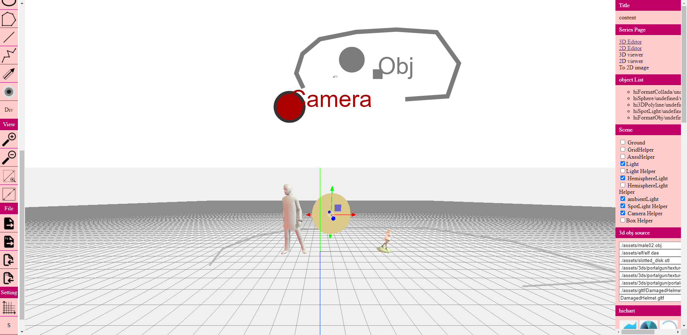

# hiEditor 2D & 3D 視覺化圖像控制編輯器  

hiEditor為純前端繪圖軟體，整合 2D `fabric.js` 繪圖套件及 3D `three.js` 繪圖套件。  
基礎介面以 JQuery 搭配 html, css實作功能操作，用戶可參考每個功能按鈕進行介面客製化重新設計。  

希望藉由簡易的操作，降低用戶進入Digital Twin (數位孿生、數位分身) 設計開發成本及加速導入跨平台web應用。  

未來將添加數據綁定功能，以低代碼方式控制物件動畫，達到即編輯即所見的效果。  

安裝 `python3` 快速運行範例程式:  

    run.bat

## 3D 繪圖  

支援3D格式:   

3ds, gltf, obj, dae 等，three.js支援的 loader js 套件皆可以添加。  

使用方式:  

透過在 2D平面上添加物件進行對 3D畫面進行細節控制，也可搭配 three.js中 controls反饋控制 2D物件，最後導出成 json格式進行儲存。  

## 2D 繪圖  

透過 fabric.js 撰寫客製化 class，支援 `div`, `video`, `image`, `heatmap` 等，`html`元素顯示。  